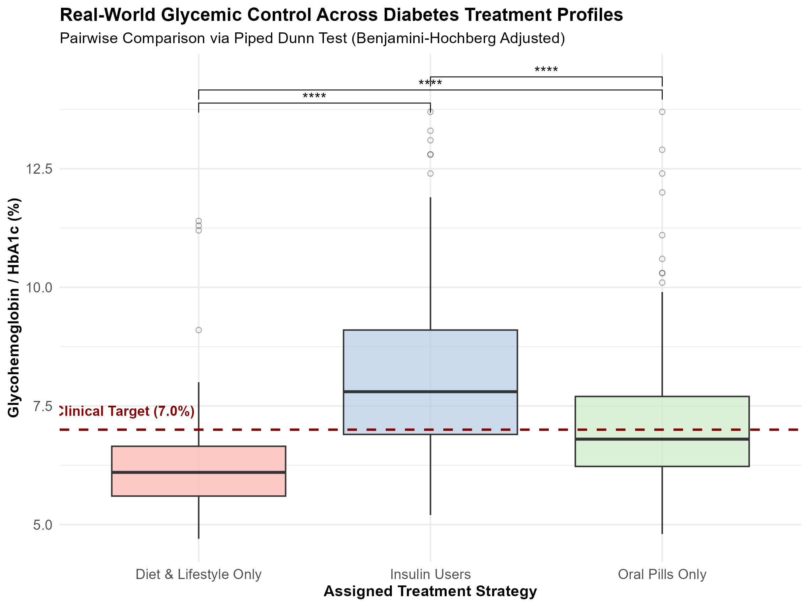

# # Medication Compliance and Treatment Efficacy Across Real-World Diabetes Management Archetypes

### *An End-to-End Biomedical Data Analysis Using CDC NHANES Data and R*


---

# Project Overview

This repository presents an end-to-end biomedical data analysis investigating medication compliance and treatment efficacy across real-world diabetes management archetypes using data from the **National Health and Nutrition Examination Survey (NHANES)** conducted by the **U.S. Centers for Disease Control and Prevention (CDC).**

Using glycated haemoglobin (HbA1c) as a biomarker of long-term glycaemic control, the analysis compares adults managing diabetes through lifestyle modification, oral medication, or insulin therapy. The project demonstrates a complete analytical workflow in **R**, encompassing data import, cleaning, transformation, exploratory analysis, statistical testing, visualization, interpretation, and reproducible scientific reporting.

Beyond answering a biomedical research question, this project forms part of my **R Data Analysis Portfolio**, documenting my continued development in biomedical data analysis, biostatistics, epidemiology, reproducible research, and scientific communication.

---

# Project Summary

| Item | Description |
|------|-------------|
| **Project Title** | Medication Compliance and Treatment Efficacy Across Real-World Diabetes Management Archetypes |
| **Dataset** | CDC National Health and Nutrition Examination Survey (NHANES) |
| **Provider** | U.S. Centers for Disease Control and Prevention (CDC) |
| **Programming Language** | R |
| **Study Design** | Cross-sectional observational analysis |
| **Outcome Variable** | Glycated Haemoglobin (HbA1c %) |
| **Treatment Groups** | Lifestyle Modification, Oral Medication, Insulin Therapy |
| **Statistical Methods** | Kruskal–Wallis Test, Dunn's Post-hoc Test |
| **Reporting** | R Markdown & Knitted PDF |
| **Project Status** | Completed |

---

# Study Objective

To investigate differences in HbA1c levels among adults with diabetes managed through lifestyle modification, oral medication, or insulin therapy, while demonstrating a reproducible biomedical data analysis workflow using R.

---

# Dataset

**Source**

National Health and Nutrition Examination Survey (NHANES)

**Provider**

U.S. Centers for Disease Control and Prevention (CDC)

The project integrates demographic, laboratory, and diabetes questionnaire datasets to create an analysis-ready dataset suitable for statistical investigation.

---

# Analytical Workflow

The project followed a structured analytical workflow:

1. Imported NHANES SAS Transport (.xpt) datasets
2. Merged multiple survey datasets
3. Cleaned and prepared the data
4. Created treatment archetypes
5. Managed missing observations
6. Performed exploratory data analysis
7. Generated descriptive statistics
8. Evaluated statistical assumptions
9. Applied appropriate non-parametric statistical methods
10. Produced publication-quality visualizations
11. Interpreted findings within a biomedical context
12. Generated a reproducible R Markdown report

---
## Key Visualizations

### HbA1c Distribution Across Treatment Groups



This boxplot illustrates the distribution of HbA1c levels across different diabetes management archetypes and provides an initial visual assessment of group differences.

---

### Normality Assessment


A Q-Q plot was used to assess the normality of HbA1c values before statistical testing. The observed deviations from the reference line supported the use of non-parametric methods for group comparisons.

# Statistical Methods

The following analytical methods were used:

- Descriptive statistics
- Kruskal–Wallis rank-sum test
- Dunn's multiple comparison test
- Boxplots using **ggplot2**
- Statistical significance annotations using **ggpubr**

Because HbA1c values exhibited skewness and violated parametric assumptions, non-parametric methods were selected to provide robust comparisons among treatment groups.

---

# Key Findings

The analysis identified statistically significant differences in HbA1c distributions across the three diabetes management archetypes.

Participants receiving insulin therapy exhibited the highest HbA1c values and the greatest variability, whereas individuals managed primarily through lifestyle modification generally demonstrated lower HbA1c values.

Importantly, these findings should be interpreted within the context of observational clinical data. Higher HbA1c levels among insulin users likely reflect greater disease severity and clinical treatment allocation rather than reduced treatment effectiveness.

---

# Skills Demonstrated

## Data Management

- Importing SAS Transport (.xpt) datasets
- Data cleaning
- Dataset merging
- Variable transformation
- Missing data management

## Statistical Analysis

- Exploratory Data Analysis (EDA)
- Descriptive statistics
- Non-parametric hypothesis testing
- Statistical interpretation

## Data Visualization

- Publication-quality graphics using **ggplot2**
- Statistical annotation using **ggpubr**

## Reproducible Research

- R scripting
- R Markdown
- Knitted PDF reporting
- Reproducible analytical workflows

---

# R Packages Used

- haven
- dplyr
- ggplot2
- ggpubr
- rstatix
- knitr

---

# Project Highlights

- Analysed real-world biomedical data from CDC NHANES.
- Imported and managed SAS Transport (.xpt) datasets.
- Merged multiple survey datasets into a unified analytical dataset.
- Applied appropriate non-parametric statistical methods.
- Produced publication-quality visualizations.
- Generated a fully reproducible analytical report using R Markdown.
- Interpreted findings within a biomedical and clinical context.

---

# Lessons Learned

This project strengthened my understanding of:

- Importing CDC NHANES datasets into R.
- Modern data manipulation using the tidyverse.
- Data cleaning and transformation.
- Managing complex biomedical datasets.
- Exploratory data analysis.
- Choosing statistical methods based on data characteristics rather than convenience.
- Clinical interpretation of statistical findings.
- Producing reproducible scientific reports using R Markdown.

Most importantly, this project reinforced that effective biomedical data analysis requires understanding both the statistical methodology and the biological context in which the data were generated.

---

# Repository Structure

```text
NHANES-Diabetes-Analysis/
│
├── README.md
├── LICENSE
│
├── data/
│   ├── raw/
│   └── cleaned/
│
├── scripts/
│   └── nhanes_analysis.R
│
├── reports/
│   ├── NHANES_Report.Rmd
│   └── NHANES_Report.pdf
│
├── figures/
│
└── outputs/
```

---

# Future Improvements

Future analyses will expand upon this work by incorporating:

- Advanced **ggplot2** visualizations.
- More efficient **dplyr** workflows.
- Regression modelling.
- Generalized Linear Models (GLMs).
- Survey-weighted analyses using NHANES sampling weights.
- Epidemiological modelling.
- Interactive reporting with Quarto.

---

# Acknowledgements

I gratefully acknowledge:

- The **U.S. Centers for Disease Control and Prevention (CDC)** for providing the publicly available NHANES datasets.
- The developers and contributors of the **R** programming language and the open-source packages used throughout this analysis.
- This project forms part of my personal **R Data Analysis Portfolio**, documenting my continued development in biomedical data analysis, biostatistics, epidemiology, and reproducible research.

---

# About the Author

## Khadija Rajab Bilale

**Biochemistry Graduate | Molecular Biology | Genetics | Bioinformatics | R for Data Analysis | One Health Research**

I am passionate about integrating molecular biology, bioinformatics, epidemiology, and data science to generate evidence that supports biomedical research, public health, wildlife conservation, and One Health initiatives. My long-term goal is to develop robust computational and analytical skills that bridge laboratory science with reproducible data-driven research.

**Connect with me:**

- LinkedIn: *(https://www.linkedin.com/in/khadija-rajab-6466972b3)*
- GitHub: *(https://github.com/khadijarajab)*

---

# License

This project is licensed under the MIT License.


